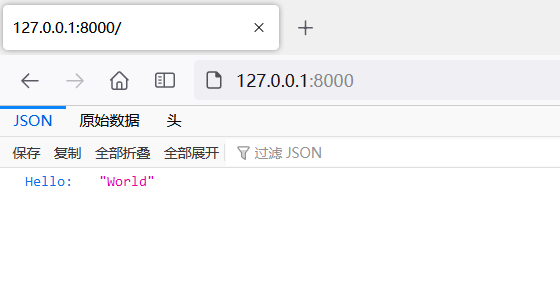

# 快速上手

## 安装

```shell
# 只安装本体
pip install fastapi

# 安装全家桶
pip install fastapi[all]
```

>  [可选依赖的具体内容](https://fastapi.tiangolo.com/zh/#_12 "Permanent link")

## hello world

```python
from fastapi import FastAPI

app = FastAPI()


@app.get("/")
def read_root():
    return {"Hello": "World"}
```

## run 起来 - 方法一：命令行

```shell
# 要先进入 main.py 所在目录
cd a01
uvicorn main:app --reload
# 或者
uvicorn a01.main:app --reload
```

## run 起来 - 方法二：调用run函数

```python
import uvicorn

from fastapi import FastAPI

app = FastAPI()


@app.get("/")
def read_root():
    return {"Hello": "World"}


if __name__ == '__main__':
    uvicorn.run("a01.main:app", reload=True)
```

## 效果


