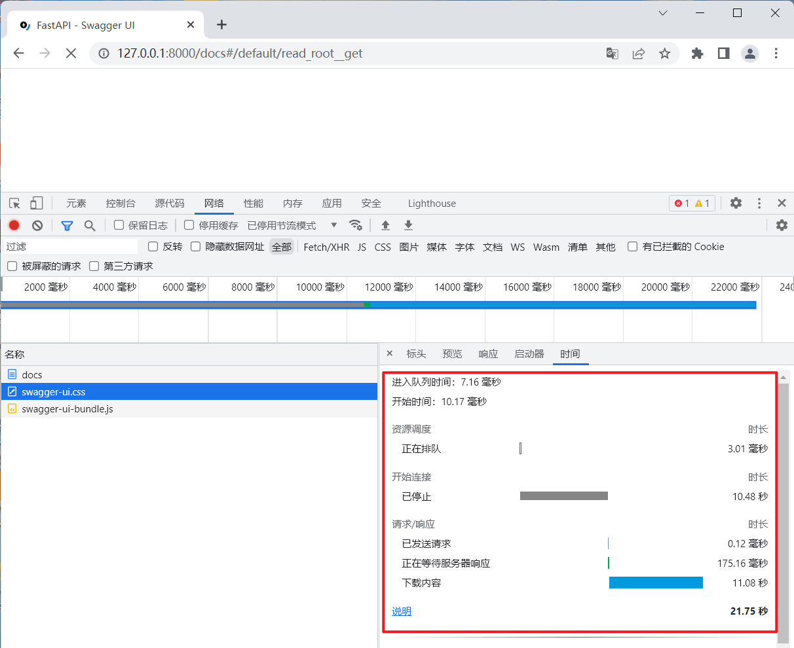

# 优化一下 /docs 界面加载慢的问题

## 现象

/docs 文档 加载很慢，有时会加载失败



## 故障分析


fastapi 在生成`swagger`文档时，所使用的静态文件的cdn服务器不给力

## 解决方法

1. 把准备好的静态文件放到 static目录下

2. 增加以下代码

```python
# docs_url=None, redoc_url=None 禁用自带的docs文档接口
app = FastAPI(docs_url=None, redoc_url=None)

# 因为下面要用到静态文件，所以，这里挂载一下
app.mount('/static', StaticFiles(directory='static'))

# 利用fastapi提供的函数，生成文档网页
@app.get("/docs", include_in_schema=False)
async def custom_swagger_ui_html():
    return get_swagger_ui_html(
            openapi_url=app.openapi_url,
            title=app.title + " - Swagger UI",
            oauth2_redirect_url=app.swagger_ui_oauth2_redirect_url,
            swagger_js_url="/static/swagger/swagger-ui-bundle.js",
            swagger_css_url="/static/swagger/swagger-ui.css")


@app.get("/redoc", include_in_schema=False)
async def redoc_html():
    return get_redoc_html(
            openapi_url=app.openapi_url,
            title=app.title + " - ReDoc",
            redoc_js_url="/static/redoc/redoc.standalone.js")
```

最后，为了方便后面的演示，我们在项目下新建一个 main.py 文件

```python
import uvicorn

if __name__ == '__main__':
    uvicorn.run("a02.main:app", reload=True)
```

## 效果


