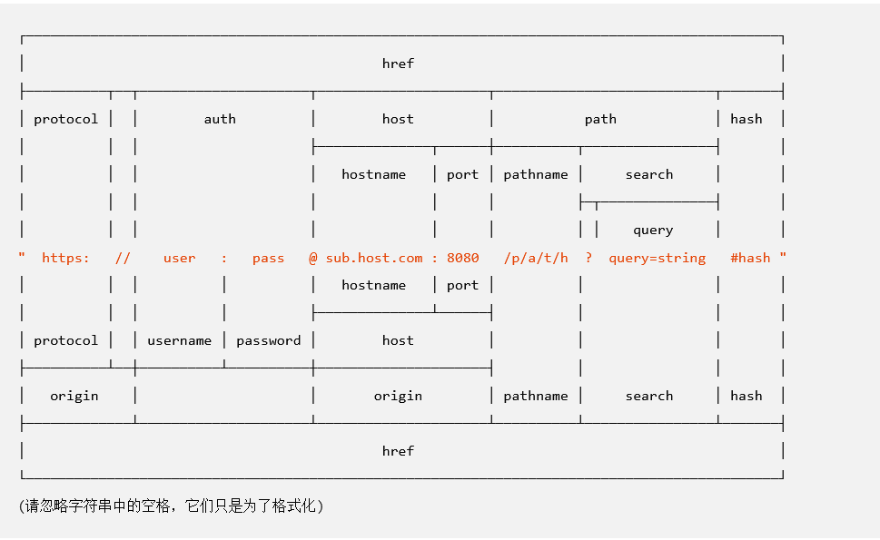

# 如何接收前端传过来的参数

## 前端可能会传什么？

- url

- 问号后面的内容

- post 的 form  body

- cookie

- header

- 上传文件

### URL参数

url 的各个部分都叫什么？



> 引自 nodejs 中文文档 [URL | Node.js 中文文档 | Node.js 中文网](https://www.nodeapp.cn/url.html)

1. Path

```python
@app.get("/path/{p}", summary="路径参数")
def get_path(p: str = Path(...)):
    return {"msg": p}


@app.get("/path/class/{c_id}/student/{s_id}", summary="多个路径参数")
def get_multi_path(c_id: int = Path(...), s_id: int = Path(...)):
    return {"c_id": c_id, "s_id": s_id}
```

2. Query

```python
@app.get("/query", summary="查询参数")
def get_query(p: str = Query(...)):
    return {"msg": p}


@app.get("/query/page", summary="分页查询")
def get_page_query(page: int = Query(1, gt=0, description="当前页码"),
           page_size: int = Query(10, gt=0, le=100, description="每页数量", alias="pageSize")):
    return {"page": page, "page_size": page_size}


@app.get("/query/order", summary="按多个字段排序")
def get_order_query(p: List[str] = Query(..., description="按指定的字段排序，可指定多个")):
    return {"msg": p}
```

### 请求体

1. Body

```python
@app.post("/body/base", summary="body - 基本使用")
def post_body(p: str = Body(...)):
    return {"msg": p}


class Car(BaseModel):
    name: str = Field(..., description="名称")
    brand: str = Field(..., max_length=10)
    price: float = Field(..., gt=0, example=10, description="价格(万)")

@app.post("/body/dict", summary="body - 传一个字典")
def post_body_dict(p: Car = Body(...)):

    return {"msg": p}

@app.post("/body/list", summary="body - 同时传多个字典")
def post_body_list(p: List[Car] = Body(...)):
    return {"msg": p}
```

> 此外，还有嵌套、Set等，这里不再赘述了，小伙伴们可以自己查阅文档
> 
> [请求体 - 嵌套模型 - FastAPI](https://fastapi.tiangolo.com/zh/tutorial/body-nested-models/#_1)

2. Form

> 略

3. File

4. UploadFile

### 请求头

1. Header

```python
@app.post("/header", summary="获取 Header 参数")
async def get_header_param(param: str = Header(..., description="自定义 Header", alias="Authorization")):
    """
    ## 当使用 `Authorization` 或 `authorization` 时，docs界面不会自动发送请求头
    ## 请使用 `Apipost` 或者 `postman` 测试这个接口
    ## 关于参数名自动转换的问题，请查看官方文档 [传送门](https://fastapi.tiangolo.com/zh/tutorial/header-params/#_1)
    """
    return {"param": param}
```

2. Cookie

```python
@app.get("/cookie", summary="获取 Cookie 参数")
async def get_cookie_param(param: str = Cookie(None, alias="CocaCola", description="自定义 Cookie", example="PepsiCo")):
    """
    ## 请使用 `Apipost` 或者 `postman` 测试这个接口，在 header 中设置 `cookie` 注意是小写的 `c`
    """
    return {"param": param}
```

## 参数的参数

> 常用参数，此处以`Body`为例进行说明，其他的基本相同

```python
def Body(  # noqa: N802
    default: Any = Undefined,               # 默认值
    *,                                      # 表示后面的都是关键字参数
    embed: bool = False,                    # 内嵌传递
    media_type: str = "application/json",
    alias: Optional[str] = None,            # 别名
    title: Optional[str] = None,            # 标题
    description: Optional[str] = None,      # 描述
    gt: Optional[float] = None,             # >
    ge: Optional[float] = None,             # >=
    lt: Optional[float] = None,             # <
    le: Optional[float] = None,             # <=
    min_length: Optional[int] = None,       # 最小长度
    max_length: Optional[int] = None,       # 最大长度
    regex: Optional[str] = None,            # 正则
    example: Any = Undefined,               # 示例
    examples: Optional[Dict[str, Any]] = None, # 示例们
    **extra: Any, # 其他可以使用的参数，可以自行查阅 pydantic 的文档
) -> Any:
    pass
```
